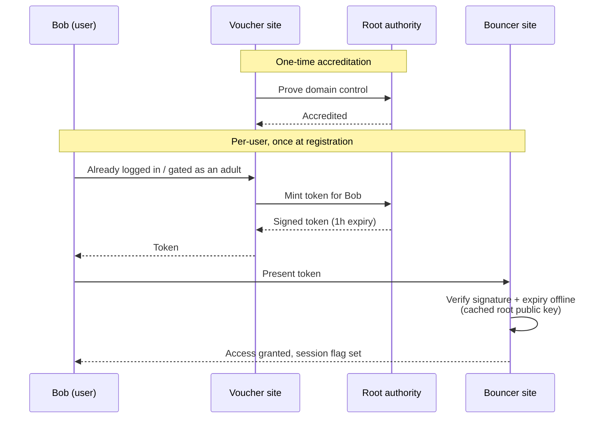

# AgeVerify

**Reusable, PII-free age-verification tokens: verify once, prove it anywhere.**

[](#status)
[](#why)
[](package.json)
[](LICENSE)

No names, no dates of birth, no documents pass through this system — only a short-lived, cryptographically signed claim: "an accredited domain vouches that this browser is controlled by an adult, as of a timestamp within the last hour."

## Why

UK sites now face "highly effective age assurance" duties under the Online Safety Act, which in practice pushes towards heavy personal-data collection (ID uploads, credit checks) at every site a user visits. AgeVerify's goal is a reusable token model instead: verify once, prove it anywhere, without a relying site ever learning who you are or which organisation vouched for you beyond "an accredited one."

This project was scoped down from an earlier, harder design (also called Voucher/Bouncer/Bob) that used in-person facial-likeness verification via zk-SNARKs. AgeVerify keeps the Voucher/Bob/Bouncer naming and roles but drops the ZK circuits, biometric capture, and revocation machinery in favour of plain signed, time-limited tokens.

## Roles

- **Root authority** — accredits Voucher domains. Proves *only* that a Voucher controls the domain it registers. Never assesses anyone's age itself, and is never told where a token is later redeemed.
- **Voucher** — an organisation that already knows its users are adults for an unrelated reason (an employer's HR records, a GP surgery's patient list, a bank's KYC, a licensed venue's door check, whatever). Once accredited, it can mint tokens for its own already-authenticated users.
- **Bob** — the end user. Visits a page on an accredited Voucher's own site, clicks once, gets a signed token valid for **1 hour**.
- **Bouncer** — any relying site. Checks Bob's token **offline** against the root's published public key (cached, no live call to root or the Voucher at redemption time). Sets its own session flag and discards the token — nothing is retained.



### How the root confirms a Voucher

This POC proves domain control via a `.well-known/ageverify.txt` file / homepage meta tag — the same pattern Let's Encrypt / Google Search Console use. That's just **one example mechanism**, chosen because it's cheap to demo; it is not the point of the design. What actually matters is that the *page Bob lands on to request a token*, on the Voucher's own site, is only reachable by people the Voucher has already confirmed are adults (an employer intranet page, a members-only area, a login-gated account page, etc). Domain-control proof merely confirms the root is minting on behalf of the domain it thinks it is; the real age gate is whatever already sits in front of that page, and a production system could swap in stronger Voucher accreditation (manual vetting, contractual terms, signed attestations) without changing anything else.

That's a deliberate trade for low friction (a Voucher integrates with one page, no vetting bureaucracy) — but it means the system's honesty rests on Vouchers only serving the certify page from pages genuinely gated behind their own authentication. This is the same trust assumption as any SSO widget.

### Expected usage pattern

A Bouncer site is expected to ask for a token **once per user, at registration** — not on every visit. Once Bob has redeemed a token and the Bouncer has set its own "verified adult" flag against his account, the Bouncer's own login/session is the thing that remembers he's verified. There's no need to re-present a token on subsequent visits; that would just be re-solving a problem the site's own authentication already solves.

## Why the root can't track redemption

The root only ever learns "Voucher X minted a token at time T." There is no double-spend check, no revocation list, no callback — a Bouncer verifies signature + expiry entirely against a cached public key. That statelessness is what makes tokens unlinkable to where they're used, without needing blind signatures.

## Status

Proof of concept. Three local Fastify servers simulate three separate origins so the domain-accreditation and Origin-based mint check are real, not faked:

| Server | Port | Role |
|---|---|---|
| `server/root.js` | 4000 | Root authority — registration, accreditation, `/api/mint`, `/.well-known/jwks.json` |
| `server/voucher-site.js` | 4001 | Demo accredited org ("Acme Corp") — serves `bob.html`, proves domain control |
| `server/bouncer-site.js` | 4002 | Demo relying site — serves `bouncer.html`, verifies tokens server-side |

Not yet built: a real Voucher onboarding/legal-terms flow, rate limiting, key rotation, a production JWKS multi-key setup, HTTPS (required in production — domain-control proof and Origin checks are meaningless over plain HTTP against a real adversary).

## Run it

```
npm install
startup.bat
```

Then:
1. Open `http://localhost:4000` (root) — register `http://localhost:4001` as a Voucher, use the "auto-place" demo shortcut, verify.
2. Open `http://localhost:4001/bob.html` — click "Get certified", copy the token.
3. Open `http://localhost:4002` — paste the token, check it.
