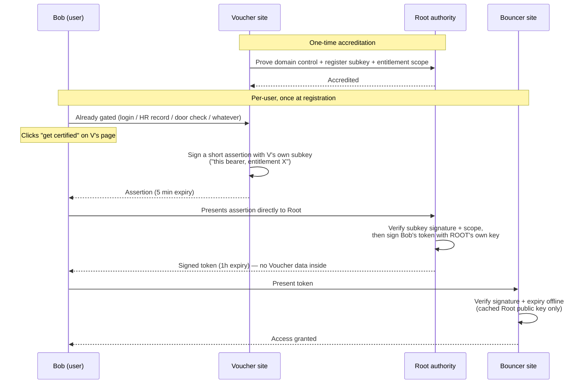

# AgeVerify

**Reusable, PII-free entitlement tokens: verify once, prove it anywhere.**

[](#status)
[](#why)
[](package.json)
[](LICENSE)

No names, no dates of birth, no documents pass through this system — only a short-lived, cryptographically signed claim: "an accredited authority certifies this bearer holds a given entitlement, as of a timestamp within the last hour." The entitlement is something like `over18` or `over21`, not identity.

## Why

UK sites now face "highly effective age assurance" duties under the Online Safety Act, which in practice pushes towards heavy personal-data collection (ID uploads, credit checks) at every site a user visits. AgeVerify's goal is a reusable token model instead: verify once, prove it anywhere, without a relying site ever learning who you are — or even which organisation vouched for you.

This project was scoped down from an earlier, harder design (also called Voucher/Bouncer/Bob) that used in-person facial-likeness verification via zk-SNARKs. AgeVerify keeps the Voucher/Bob/Bouncer naming and roles but drops the ZK circuits, biometric capture, and revocation machinery in favour of plain signed, time-limited tokens.

## Roles

- **Root authority** — accredits Vouchers. Registers a Voucher's own signing subkey and the entitlement(s) it's trusted to assert, once. Never assesses anyone's age itself, never learns about an individual Bob, and never learns where a token is later redeemed. It mints Bob's *actual* token itself, using its own single key.
- **Voucher** — an organisation that already knows its users hold some entitlement for an unrelated reason (an employer's HR records, a GP surgery's patient list, a bank's KYC, a licensed venue's door check, whatever). Once accredited, it holds its own signing subkey and can authorize its own already-gated users — but it never mints Bob's final token, and never contacts Root at Bob's click time.
- **Bob** — the end user. Visits a page on an accredited Voucher's own site (already gated behind whatever that Voucher checks), clicks once, and ends up with a signed token valid for **1 hour**.
- **Bouncer** — any relying site. Checks Bob's token **offline** against Root's published public key (cached, no live call to Root or the Voucher at redemption time).

### Who learns what

This is the property the design is actually built around — not just "no PII exists," but each party's view is structurally limited to what it needs:

- **Voucher** knows Bob asked for proof to take to Root — nothing more. It never learns whether that proof was redeemed, or where.
- **Root** knows which Voucher issued the authorization (it has to, to check the signature) — but never learns anything about Bob, and never learns where the resulting token gets used.
- **Bouncer** knows which Root/CA issued the token — never which Voucher. Root mints Bob's token with its own single key, shared across every Voucher it accredits, so the token itself carries no Voucher-identifying data at all. This isn't policy — there's structurally nothing in the token for Bouncer to read.

If a Voucher, Root, and Bouncer went out-of-band and compared notes, they *could* reconstruct who Bob is — but that's collusion outside the protocol, the same as any credential scheme. The protocol's job is to never require or transmit that correlation itself, not to defend against parties breaking the law together.



### How the root confirms a Voucher

This POC proves domain control via a `.well-known/ageverify.txt` file / homepage meta tag — the same pattern Let's Encrypt / Google Search Console use. That's just **one example mechanism**, chosen because it's cheap to demo; it is not the point of the design. What actually matters is that the *page Bob lands on to request an assertion*, on the Voucher's own site, is only reachable by people the Voucher has already confirmed hold the entitlement (an employer intranet page, a members-only area, a login-gated account page, a door check, etc). Domain-control proof merely confirms Root is accrediting the site it thinks it is; the real entitlement gate is whatever already sits in front of that page, and a production system could swap in stronger Voucher accreditation (manual vetting, contractual terms, signed attestations) without changing anything else.

That's a deliberate trade for low friction (a Voucher integrates with one page, no vetting bureaucracy) — but it means the system's honesty rests on Vouchers only serving the certify page from pages genuinely gated behind their own authentication. This is the same trust assumption as any SSO widget.

### Expected usage pattern

A Bouncer site is expected to ask for a token **once per user, at registration** — not on every visit. Once Bob has redeemed a token and the Bouncer has recorded its own "entitled" flag against his account, the Bouncer's own login/session is the thing that remembers he's verified. There's no need to re-present a token on subsequent visits; that would just be re-solving a problem the site's own authentication already solves. (The demo's Bouncer check is a stateless one-shot verify — it doesn't implement account persistence, since there are no accounts in a three-server POC.)

## Why the root can't track redemption

Root only ever learns "Voucher X's subkey authorized entitlement Y at time T" — it has no idea which Bob, and no idea where the resulting token ends up. There is no double-spend check, no revocation list, no callback from Bouncer — a Bouncer verifies signature + expiry entirely against a cached public key. That statelessness is what makes tokens unlinkable to where they're used.

## Status

Proof of concept. Three local Fastify servers simulate three separate origins so the domain-accreditation, subkey-signed assertions, and Root's own minting are real, not faked:

| Server | Port | Role |
|---|---|---|
| `server/root.js` | 4000 | Root authority — Voucher registration/accreditation, `/api/mint`, `/.well-known/jwks.json` |
| `server/voucher-site.js` | 4001 | Demo accredited org ("Acme Corp") — serves `bob.html`, proves domain control, signs Bob's assertion with its own subkey |
| `server/bouncer-site.js` | 4002 | Demo relying site — serves `bouncer.html`, verifies tokens server-side against Root's key only |

Not yet built: a real Voucher onboarding/legal-terms flow, rate limiting, subkey rotation/revocation beyond "Root stops accepting it," a production JWKS multi-key setup, HTTPS (required in production — domain-control proof and signature checks are meaningless over plain HTTP against a real adversary), Bouncer-side account persistence.

## Run it

```
npm install
startup.bat
```

Then:
1. Open `http://localhost:4000` (root) — register `http://localhost:4001` as a Voucher, use the "auto-place" demo shortcut, pick entitlement(s), verify.
2. Open `http://localhost:4001/bob.html` — click "Get certified", copy the token.
3. Open `http://localhost:4002` — paste the token, check it.
